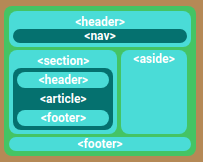

## 3.5 - Project

The main goal here was to design a static webpage using each and every format and specification given.

## Requisitos Obrigatórios:

Você deve criar um site que com uma série de informações a respeito do que você aprendeu nos últimos três blocos, estilizado de forma apropriada.

**Em outras palavras, uma página de `Lessons Learned`**;

**Lembre-se de verificar sua página no [achecker](https://achecker.ca/checker/index.php).**

## Requisitos do projeto

### 1 - O corpo da página deve possuir uma cor de fundo específica

- Possuir cor de fundo: rgb(253, 251, 251)

### 2 - Seu site deve possuir uma barra superior com um título

- A barra deve possuir o ID "cabecalho"

- O elemento com o id `cabecalho` deve ser fixo no topo da página, com a propriedade top tendo `0px`

- O título deve estar dentro da barra e possuir o ID "titulo", além de ser uma tag `h1`

### 3 - A página deve possuir uma foto sua

- A foto deve ser inserida utilizando uma tag `img` com o ID "minha_foto"

### 4 - A página deve possuir uma lista de lições aprendidas

- A lista deve ser numerada e possuir o ID "licoes_aprendidas"

- A lista deve possuir 10 itens

### 5 - A página deve possuir uma lista de lições que ainda deseja aprender

- A lista **não** deve ser numerada e deve possuir o ID "licoes_a_aprender"

- A lista deve possuir 10 itens

### 6 - A página deve possuir um rodapé

- O rodapé deve utilizar a tag `footer` e possuir o ID "rodape"

### 7 - A página deve possuir pelo menos um link externo

- A configuração desse link deve ser feita para abrir em uma nova aba do navegador

### 8 - Crie um artigo sobre seu aprendizado

- A `tag` `article` devem ser utilizadas

- O artigo deve ter mais de 300 letras e menos de 600

### 9 - Crie uma seção que conta uma passagem sobre seu aprendizado

- A `tag` `aside` deve ser utilizada

- A seção deve ter mais que 100 letras e menos que 300

### 10 - Torne o seu site mais acessível e melhore seu ranqueamento em mecanismos de busca na Web aplicando os elementos HTML de acordo com o sentido e propósito de cada um deles

- A página deve possuir um elemento `article`

- A página deve possuir um elemento `header`

- A página deve possuir um elemento `nav`

- A página deve possuir um elemento `section`

- A página deve possuir um elemento `aside`

- A página deve possuir um elemento `footer`

### 11 - Seu site deve passar sem problemas na verificação de semântica do site achecker

## Requisitos Bônus:

### 12 - Adicione uma tabela à página

- A página deve possuir uma tabela

### 13 - Brinque com o Box model!

- Altere `margin`, `padding` e `border` dos elementos para ver, na prática, como esses atributos influenciam e melhoram a visualização dos componentes

### 14 - Altere atributos relacionados as fontes

- Altere o tamanho da letra

- Altere a cor da letra

- Altere o espaçamento entre as linhas

- Altere o `font-family`

### 15 - Faça com que seu artigo e seção sobre aprendizados fiquem um ao lado do outro

- Utilizar a classe 'lado-esquerdo'

- Utilizar a classe 'lado-direito'

- Verificar se os elementos com as classes lado-direito e lado-esquerdo estão posicionados corretamente

#### Comments

The most interesting feature i developed here was the semantic HTML struture, shown below:

Why? Because it was entirely constructed with <divs> and CSS! It's the perfect example of how much i've learned on the box model and how to manipulate it as i wish using CSS.

###### Feedback

As always, any feedback or suggestion is welcomed.

