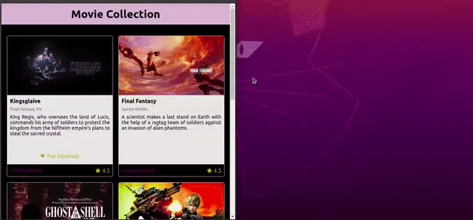

## Project 01 - CRUD Movie Library

**Important:** This is the third part of a *3-part* series of project involving the theme "Movie Library".

You can check part one [here](../../11_REACT_INTRO/Project_01_Movie_Library)
And part two [here](../../12_REACT_STATE_EVENT_FORMS/Project_01_Stateful_Movie_Library)

## First Looks

You can check the project functionality and overall look on the gif below. Pay close attention to the Movie Card responsivity. It's done with a very few CSS lines. Check it out on the comments section below for the full code.



### What was proposed here

As a literal copy/paste of the instructions:

## O que deverá ser desenvolvido

Dando continuidade aos últimos projetos, você criará um **CRUD** de cartões de filmes em React.
A sigla **CRUD** significa, _Create, Read, Update and Delete_, então deve ser possível realizar as seguintes operações nesse projeto:

  - Adicionar um novo filme à lista - **CREATE**;
  - Listar todos os filmes cadastrados, com uma página de informações resumidas sobre cada filme e uma página de informações detalhadas de um filme selecionado - **READ**;
  - Editar um filme da lista - **UPDATE**;
  - E apagar um filme da lista - **DELETE**;

Nos últimos projetos, por mais que o app tenha sido desenvolvido utilizando múltiplos componentes, o que é uma boa prática, todas as funcionalidades eram acessadas ao mesmo tempo, no mesmo lugar, utilizando apenas uma URL (`localhost:3000`, normalmente). Na mesma página onde havia a listagem de filmes, havia um formulário pra criar um novo filme, por exemplo. À medida que seus apps se tornarem maiores e mais complexos, isso se tornará inviável. Desta vez, as funcionalidades do app serão agrupadas e organizadas em rotas.

Uma rota define o que deve ser renderizado na página ao abri-la. Cada rota está associada a um caminho. O caminho é a parte da URL após o domínio (nome do site, de forma simplificada). Por exemplo, em `www.site.com/projetos/meu-jogo`, o caminho é `/projetos/meu-jogo`. Até agora, todos os apps React que você desenvolveu possuíam somente uma rota, a raiz (`/`).

Este app terá 4 rotas:

1. A rota raiz (index), no caminho `/`. Esta rota exibirá uma lista com todos os filmes cadastrados. Essa lista contém informações resumidas sobre cada filme.

2. Uma rota para criar novos filmes, no caminho `/movies/new`. Essa rota renderizará um formulário para adicionar um novo filme.

3. Uma rota para mostrar informações detalhadas de um filme, no caminho `/movies/:id`. Onde o `:id` é o parâmetro da URL que representa o _id_ do filme exibido. Por exemplo, ao entrar no caminho `/movies/5`, serão exibidas informações sobre o filme com _id_ `5`.

4. Uma rota para editar um filme, no caminho `/movies/:id/edit`. Assim como na rota 3, `:id` é o _id_ do filme a ser editado. Essa rota renderizará um formulário idêntico ao da rota 2. Nesse caso, porém, o formulário virá preenchido com as informações do filme a ser editado. Ao submeter o formulário, ao invés de criar um novo filme, o filme em questão terá seus dados atualizados.

Relacionado a cada rota haverá um componente React responsável por renderizar seu conteúdo. Esse mapeamento entre o caminho da URL, rota e componente será feito pelo `React Router`, a principal biblioteca de roteamento em `React`.

Naturalmente, haverá links de navegação e redirecionamento entre as diferentes rotas. Por exemplo, na rota 1 (caminho `/`), haverá, para cada filme, um link para a rota 3 (caminho `/movies/:id`), onde se poderá ver informações detalhadas sobre o filme escolhido. Na rota 3 (caminho `/movies/:id`), haverá um link para a rota 4 (caminho `/movies/:id/edit`), a fim de se editar informações do filme. Ao submeter o formulário, o app automaticamente será levado de volta à rota 3 (caminho `/movies/:id`), mostrando as informações atualizadas do filme. Tudo isso será feito utilizando os componentes da biblioteca `React Router`.

Outra diferença importante neste projeto em relação aos anteriores é que os dados virão de uma API (simulada) e não mais de um arquivo estático. Você utilizará essa API para criar, ler, atualizar e apagar filmes. Logo, você terá que lidar com requisições assíncronas e _promises_. Também deverá fazer uso de _lifecycle methods_ e de estados para controlar o que é renderizado por seus componentes a depender de em que momento as requisições se encontram.

---

### 1 - Rotas: O componente `App` deve renderizar `BrowserRouter`

Você deve utilizar um `BrowserRouter` pra criar as rotas da sua aplicação. As urls de cada página devem ser desenvolvidas conforme especificado na seção _O que será desenvolvido_.

### 2 - Movie list: Ao ser montado, `MovieList` deve fazer uma requisição para buscar a lista de filmes a ser renderizada

Para buscar a lista, você deve utilizar a função `getMovies` importada do módulo `movieAPI` em `MovieList`. Essa função retorna uma _promise_. A requisição deve ser feita no momento em que o `MovieList` for montado no DOM. Enquanto a requisição estiver em curso, `MovieList` deve renderizar o componente `Loading`, como ilustrado na imagem a seguir.

Obs: O componente `Loading` deve conter o texto `Carregando...`

Uma vez que a requisição retornar, o resultado deve ser renderizado. Para cada filme, renderize um componente `MovieCard`.

Você precisará adicionar um estado em `MovieList` para controlar o que será exibido.

### 3 - `MovieCard`: deve possuir um link para a página de detalhes de um filme

Todos os `MovieCard`s devem possuir em seu conteúdo, pelo menos, o título, a sinopse e um link com o texto "VER DETALHES" que aponta para a rota `movies/:id`, onde `:id` é o id do filme. Esta rota exibirá informações detalhadas de um filme.

### 4 - `MovieDetails`: deve fazer uma requisição para buscar o filme que deverá ser renderizado

`MovieDetails` se comporta de forma muito semelhante ao `MovieList`. Ao ser montado, deve fazer uma requisição utilizando a função `getMovie`, se atente para o nome da função que é muito semelhante ao de outra função que já utilizamos, a `getMovies`, do módulo `movieAPI`, passando o id do filme. O componente `Loading` deve ser renderizado enquanto a requisição estiver em curso. Após terminar, deve-se renderizar um card com mais detalhes sobre o filme, contendo:

  - Uma `` com a imagem do filme e `alt='Movie Cover'`;
  - Título;
  - Subtítulo;
  - Sinopse;
  - Gênero;
  - Avaliação;
  - um link com o texto "EDITAR" apontando para a rota `/movies/:id/edit` e um link apontando para a rota raiz (`/`) com o texto "VOLTAR".

### Para os requisitos 5 e 6:

Para correta avaliação, os campos do formulário devem possuir as seguintes tags `<label>` e  tipos de entrada:
- label: 'Título', entrada: tag `<input>` de tipo 'text'
- label: 'Subtítulo', entrada: tag `<input>` de tipo 'text'
- label: 'Imagem', entrada: tag `<input>` de tipo 'text'
- label: 'Sinopse', entrada: tag `<textarea>`
- label: 'Gênero', entrada: tag `<select>`, com as seguintes opções:
    - `<option value="action">Ação</option>`
    - `<option value="comedy">Comédia</option>`
    - `<option value="thriller">Suspense</option>`
    - `<option value="fantasy">Fantasia</option>`
- label: 'Avaliação', entrada: tag `<input>`, de tipo 'number' com valores que vão de 0 (mínimo) a 5 (máximo), com um step de 0.1.

Obs: O conteúdo das tags `<label>` devem estar idênticos ao específicado acima. Importante associar corretamente todas as suas entradas e labels!

### 5 - `EditMovie`: deve realizar uma requisição para buscar o filme que será editado.

Ao ser montada, a página de edição do filme deve fazer uma requisição pra buscar o filme que será editado e deve, ao ter seu formulário submetido, atualizar o filme e redirecionar a página pra rota raíz.

### 6 - `NewMovie`: Na página inicial, deve haver um link para criar novos cartões.

O link deve conter o texto "ADICIONAR CARTÃO" e apontar para a rota `/movies/new`, contendo um formulário para criar novos cartões.

Na rota `/movies/new`, utilizando a callback passada para `MovieForm`, `NewMovie` deve criar um novo cartão utilizando a função `createMovie` do módulo `movieAPI`. Após o fim da requisição, `NewMovie` deve redirecionar o app para a página inicial, contento o novo cartão.

### 7 - Adicione proptypes a todos os componentes

Todos os componentes que recebem _props_ devem ter suas _proptypes_ corretamente declaradas. O _eslint_ checa automaticamente declaração de _proptypes_, portanto seu _Pull Request_ deverá passar no _Code Climate_ para satisfazer esse requisito.

### Bônus: Adicione um link para deletar um cartão em `MovieDetails`.

Ao clicar neste link, faça uma requisição utilizando a função `deleteMovie` do módulo `movieAPI`. Após finalizar a requisição, redirecione o app para a página inicial. O cartão apagado não deverá mais se encontrar na lista.

---

### Grade

This project got a **100%/100%** grade and can be checked out entirely on [here](https://github.com/tryber/sd-06-project-movie-card-library-stateful/pull/90).


#### Comments

CRUD operations are common anywhere on the internet. As such, is part of the web-developer's day to understand and apply these 4 concepts really well.

As a highlight for the project, the CSS used to create the movie card Library (our home page) is clean and direct to what it wants to be done: Create a grid with the movies we have on memory. Check it out:

```css
.movie-list {
  column-gap: 1rem;
  display: grid;
  grid-template-columns: repeat(auto-fit, minmax(250px, 1fr));
  margin-top: 16px;
  padding: 16px;
  row-gap: 1rem;
}
```

Obviously it takes more CSS to style the cards themselves, but this small setting pretty much kills it.

Because there could be different states responsible for filtering ALL movies, it was decided that applying 3 instances of pretty straight forward '.filter' calls would be the cleanest way to achieve this goal. Any particular feedback on this logic would be awesome, tho.

###### Feedback

As always, any feedback or suggestion is welcomed.