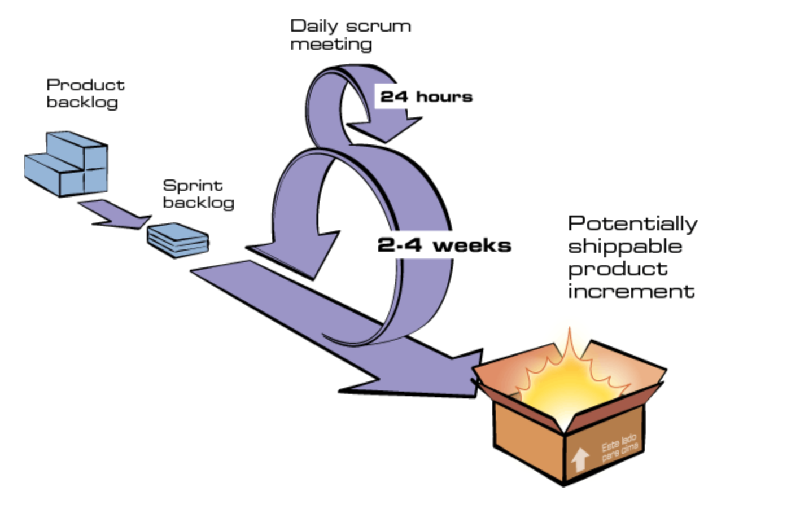
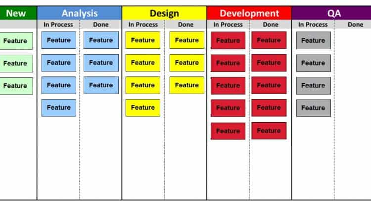

## Module 14 - Agile Development

This directory covers Trybe's 14th module.

## What was covered here?

We step off the 'hard skill content lane' for a module to learn more about Agile Development!

As it's known, there are a lot of *frameworks* surrounding Agile's ideas. On this module, after reading and understanding more about the [Agile Manifesto](https://agilemanifesto.org/), we focus our energy on 2 of said frameworks:

* **SCRUM**: Centered around *sprints* of development, pre-determined period of time dedicated to developing what was, also, previously defined that should be done. It's based on quick, directly to the point, daily meetings so the team can communicate with each other and focus on getting things done. A visual representation of this would be:

* **KANBAN**: A visual way of dividing and keeping track of everything that needs to be done (on an entire project or on a sprint). It's usually a board (or virtual board), accessible generally by the entire team. It should look something like:

If you find this format familiar, this is exactly what [Trello](https://trello.com/) is based on. If you just found out about it, i highly recommend checking it out! It's free and really easy to organize even your daily tasks.

---

Because this whole module references team work, the only 'hard skill' we cover is a Project to develop the front end of an online store *in a group of 4 students*. You can check it out:

* [Project 01 - Frontend Online Store](./Project_01_Frontend_Online_Store)

Simply click on the desired link above.

#### Comments

As your application grows, it becomes clearer that organization and procedures for team work are completely necessary. How'd you organize your team to work on 4 different features at the same time, starting from the same project? How'd that day-to-day basis be?

This is exactly why we need to adopt an Agile Development mindset. (Quick note: obviously this is not the only methodology that solves this and other issues, but it's recognized as one of the best to at the very least, know about nowadays.)

###### Feedback

As always, any feedback or suggestion is welcomed.
