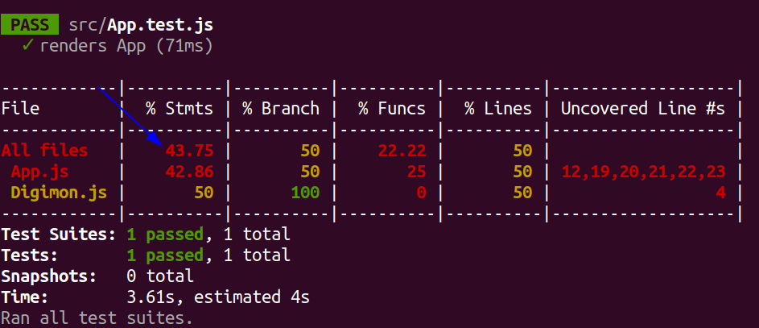
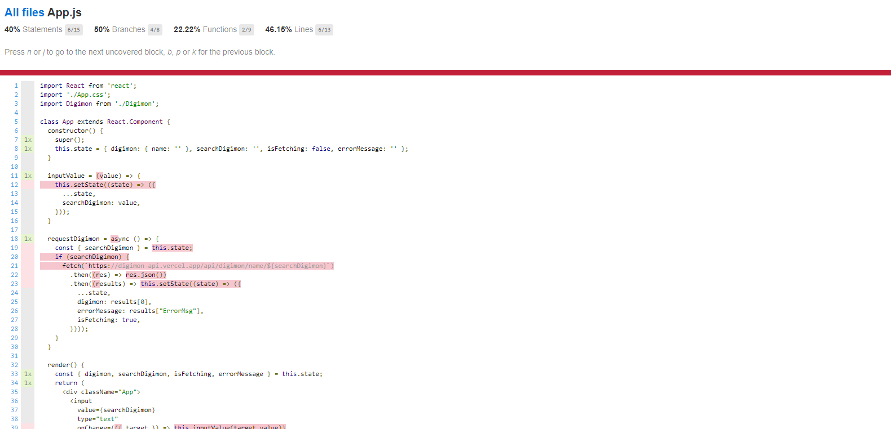

Esse é um projeto para o conteúdo de `React Testing Library`.

### COMEÇANDO OS EXERCÍCIOS

Este repositório contém uma aplicação funcional, ela utiliza a [Digimon API](https://digimon-api.herokuapp.com/).

É uma aplicação simples que pesquisa digimons pelo nome, seu objetivo nesse exercício é utilizar todos os aprendizados sobre testes até o momento para alcançar 100% de cobertura de testes, você pode verificar essa cobertura utilizando o comando `npm run test-coverage`, ele te retorna um relatório como o abaixo:

A seta azul mostra o local que deve estar com o valor de 100, o que indica a finalização do exercício com todas as linhas do código testadas.

### INSTRUÇÕES

* Ao rodar o comando `npm run test-coverage`, será gerada uma nova pasta na raiz do seu projeto chamada `coverage`, após criada, abra o arquivo `./coverage/Icov-report/index.html` usando a extensão `Live Server` do seu VSCode.

* Veja os detalhes sobre o quê a cobertura de testes está avaliando, clicando no link do arquivo:

* Utilize essa lista como referência para programar seus testes. Cubra todos as linhas destacadas para ter 100% de cobertura!

### TESTANDO OS TESTES

"Testar testes" pode parecer um conceito estranho, mas existem técnicas bastante engenhosas para isso. A que vamos usar aqui no nosso exercício baseia-se em inserir vários bugs nos arquivos do projeto e verificar se os testes que você programou continua rodando ou apontando as falhas. Caso eles (os testes) não percebam os bugs, significa que os seus testes estão acusando falsos positivos (ou negativos também), legal né?

Esses bugs são chamados de "mutantes", e a nossa missão aqui é eliminá-los! Você pode até pensar nisso como um joguinho, e para que possamos fazer tudo de forma controlada, vamos utilizar uma library chamada [Stryker](https://stryker-mutator.io/).

O Stryker irá gerar os mutantes automaticamente de acordo com a configuração passada pra ele, geralmente num arquivo `JS` podendo também ser num `JSON`. Se você acessar a raiz do nosso exercício, encontrará o arquivo `stryker.conf.js`. Abra-o e dê uma espiada! Se você tiver curiosidade sobre como funcionam as configurações, poderá acessar seu repositório e ler o [README](https://github.com/stryker-mutator/stryker/tree/master/packages/core#readme).

### Como usar o Stryker?

Usar o Stryker é bastante fácil, basta rodar o comando `stryker run` nos projetos que têm ele configurado. Você pode também instalá-lo de forma global usando o comando `npm install -g stryker-cli`.

---

**Divirta-se codando!** 🚀
