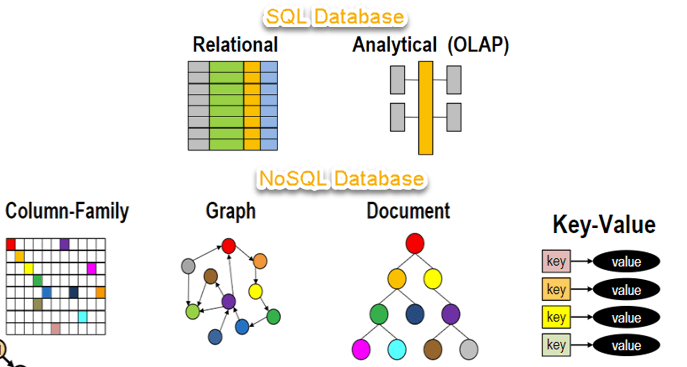

# 23.1 - MongoDB Introduction

After digging deep on SQL syntax and concepts using [MySQL](https://www.mysql.com/), it's time we advance to a more modern database concept: noSQL(Not only SQL)!

NoSQL is a group of mainly 4 different type of databases:

1. key/value
2. Column family
3. Document
4. Graphs

A visual representation can be seen:

As to differences between SQL and noSQL, we can list:

## Advantages of NoSQL

- Can be used as Primary or Analytic Data Source
- Big Data Capability
- No Single Point of Failure
- Easy Replication
- No Need for Separate Caching Layer
- It provides fast performance and horizontal scalability.
- Can handle structured, semi-structured, and unstructured data with equal effect
- Object-oriented programming which is easy to use and flexible
- NoSQL databases don't need a dedicated high-performance server
- Support Key Developer Languages and Platforms
- Simple to implement than using RDBMS
- It can serve as the primary data source for online applications.
- Handles big data which manages data velocity, variety, volume, and complexity
- Excels at distributed database and multi-data center operations
- Eliminates the need for a specific caching layer to store data
- Offers a flexible schema design which can easily be altered without downtime or service disruption

## Disadvantages of NoSQL

- No standardization rules
- Limited query capabilities
- RDBMS databases and tools are comparatively mature
- It does not offer any traditional database capabilities, like consistency when multiple transactions are performed simultaneously.
- When the volume of data increases it is difficult to maintain unique values as keys become difficult
- Doesn't work as well with relational data
- The learning curve is stiff for new developers
- Open source options so not so popular for enterprises.

# MongoDB

[Mongo](https://www.mongodb.com/1) is a **Document** type of noSQL. It uses and stores data much like in JSON format (actually, BSON). This allows us to store more complex data together in one collection (similar to a SQL table)

## Exercises

On this module we have 1 batch of 10 exercise.

You can find them below:

- [Exercises](./exercises/readme.md)

----

#### Comments

MongoDB is the most famous noSQL database today (2021). It's seen use on a wide variety of applications all over the world. As such, knowing how to use it properly and it's benefits (and cons) should be greatly incentivized to anyone in the field.

Because of it's easy query methods, it can be easier to walk the first steps and test Mongo on your small, local application. Better yet, it's shell interface is even easier to use than MySQL's.

###### Feedback

As always, any feedback or suggestion is welcomed.

