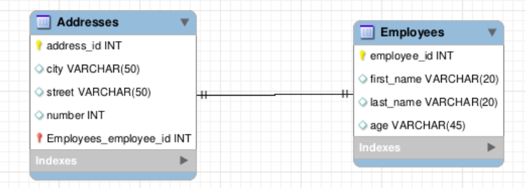

# 31.3 - ORM: ASSOCIATIONS

After understanding how to use [Sequelize](https://sequelize.org/) as an ORM for a basic CRUD, it's time to see how to use the most important feature about SQL: **relations**.

## 1:1 Relations

Let's examine this example:



If we consider that each address must belong to an Employee, let's first create their table:

```javascript
module.exports = {
  up: async (queryInterface, Sequelize) => {
    const EmployeesTable = await queryInterface.createTable('employees', {
      employee_id: {
        allowNull: false,
        autoIncrement: true,
        primaryKey: true,
        type: Sequelize.INTEGER,
      },
      first_name: { allowNull: false, type: Sequelize.STRING },
      last_name: { allowNull: false, type: Sequelize.STRING },
      age: { allowNull: false, type: Sequelize.INTEGER },
    });

    return EmployeesTable;
  },

  down: async (queryInterface) => await queryInterface.dropTable('employees'),
};
```

And now, we can create the addresses table with the `employee_id` already linked by a FK:

```javascript
module.exports = {
  up: async (queryInterface, Sequelize) => {
    const AddressesTable = await queryInterface.createTable('addresses', {
      address_id: {
        allowNull: false,
        autoIncrement: true,
        primaryKey: true,
        type: Sequelize.INTEGER,
      },
      city: { allowNull: false, type: Sequelize.STRING },
      street: { allowNull: false, type: Sequelize.STRING },
      number: { allowNull: false, type: Sequelize.INTEGER },
      employee_id: {
        type: Sequelize.INTEGER,
        allowNull: false,
        onUpdate: 'CASCADE',
        onDelete: 'CASCADE',
        // model = table name, key = column referenced on that table
        references: { model: 'employees', key: 'employee_id' },
      },
    });

    return AddressesTable;
  },

  down: async (queryInterface) => await queryInterface.dropTable('addresses'),
};
```

With our database migrated, we need to reflect this relation on our models, as to take advantage of it when querying. To do that, we have 4 methods to use inside our method definition:

- hasOne
- belongsTo
- hasMany
- belongsToMany

On this case, one employee **has one** address and one address **belongs to** one employee. That would be:

```javascript
const createAddresses = (sequelize, DataTypes) => {
  const Address = sequelize.define('Address', {
    address_id: { type: DataTypes.INTEGER, primaryKey: true },
    city: DataTypes.STRING,
    street: DataTypes.STRING,
    number: DataTypes.INTEGER,
    employee_id: { type: DataTypes.INTEGER, foreignKey: true },
  },
  {
    timestamps: false,
  });

  Addresses.associate = (models) => {
    Addresses.belongsTo(
      models.Employee,
      { foreignKey: 'employee_id', as: 'addresses' },
    );
  };

  return Address;
};

module.exports = createAddresses;
```

Pay close attention to the syntax, as it references the other model we create:

```javascript
const createEmployees = (sequelize, DataTypes) => {
  const Employee = sequelize.define('Employee', {
    employee_id: { type: DataTypes.INTEGER, primaryKey: true },
    first_name: DataTypes.STRING,
    last_name: DataTypes.STRING,
    age: DataTypes.INTEGER,
  },
  {
    timestamps: false,
  });

  Employees.associate = (models) => {
    Employees.hasOne(
      models.Address,
      { foreignKey: 'employee_id', as: 'addresses' },
    );
  };

  return Employee;
};

module.exports = createEmployees;
```

## Querying with a relation:

One would simply pass in the configuration property **include**, as follows:

```javascript
const employees = await Employee.findAll({ include: { model: Address, as: 'addresses' } });
```

> If you have more relations, just pass in an Array to the include attribute

This would return a property on each employee, containing the address data. Pay attention that the model points to our created entity above.

## 1:N Relations

Very similar to the 1:1 relation above. Let's say each employee can have more than one address. It's model relation would be:

```javascript
Employee.associate = (models) => {
  Employee.hasMany(
    models.Address,
    { foreignKey: 'employee_id', as: 'addresses' },
  );
};
```

### Types of relation loads

When it comes to querying and returning data with relations, there are two types of load strategies:

* Eager Loading: All data available is queried, joined and sent back to the requested. (just like the above findAll method)
* Lazy Loading: Relations are only queried as it's explicitly requested.

An example of *Lazy Loading* would be if we had a route on our server that returned all the employees, but would only return them *with* their address information if requested with a **query param** like

> GET url.com/employees?addresses=true

Which would, in turn, add the information.

## N:N Relations

Now take a look at this example:

!(./assets/manyToMany.png)

Because this requires a special table, **neither** of our models would have any relation indication. Instead, we would create a third model, representing our mid-table, to address this:

```javascript
const createUserBooks = (sequelize, _DataTypes) => {
  const UserBooks = sequelize.define(
    'UserBook',
    {},
    { timestamps: false, tableName: 'user_books' },
  );

  UserBooks.associate = (models) => {
    models.Book.belongsToMany(models.User, {
      as: 'users',
      through: UserBook,
      foreignKey: 'book_id',
      otherKey: 'user_id',
    });

    models.User.belongsToMany(models.Book, {
      as: 'books',
      through: UserBook,
      foreignKey: 'user_id',
      otherKey: 'book_id',
    });
  };

  return UserBooks;
};

module.exports = createUserBooks;
```

Because it's a mid table, Sequelize understands it's content using the association, so there's no need to pass in the table fields explicitly.

And one would query by:

```javascript
await User
  .findAll({
    include: [{ model: Book, as: 'books', through: { attributes: [] } }],
  });
```

## Exercises

On this module we have 1 batch of exercises. You can check them out below:

* [Associations Exercise](./exercises)

----

#### Comments

Performing joins and linking tables can be time consuming and lead to mistakes. By abstracting the query away and using JS objects and classes to point to each other, letting the ORM do the 'hard work' of joining the tables and returning the correct result is awesome.

When it comes to Sequelize, tho, it can be a little confusing at first, but practice, as always, helps to understand it better.

###### Feedback

As always, any feedback or suggestion is welcomed.

