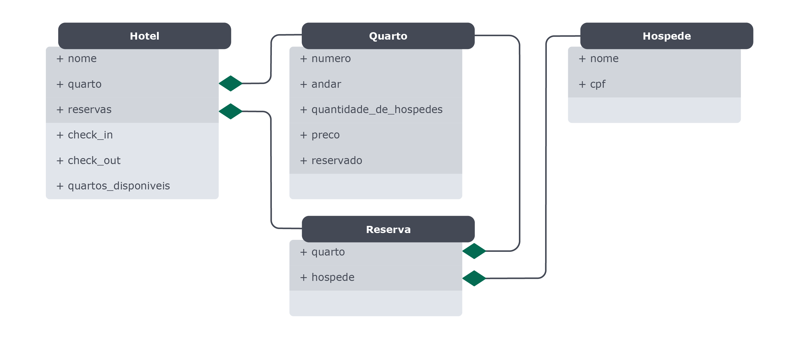

# OOP Exercises

**Exercício 1**: Faça uma classe de TV:

Atributos:
volume - será inicializado com um valor de 50 e só pode estar entre 0 e 99;
canal - será inicializado com um valor de 1 e só pode estar entre 1 e 99;
tamanho - será inicializado com o valor do parâmetro;
ligada - será inicializado com o valor de False , pois está inicialmente desligado.
Todos os atributos devem ser privados.

Métodos:
aumentar_volume - aumenta o volume de 1 em 1 até o máximo de 99;
diminuir_volume - diminui o volume de 1 em 1 até o mínimo de 0;
modificar_canal - altera o canal de acordo com o parâmetro recebido e deve lançar uma exceção ( ValueError ) caso o valor esteja fora dos limites;
ligar_desligar - alterna o estado da TV entre ligado e desligado ( True / False ).

**Exercício 5:** Implemente um gerenciador de quartos de hotel, simplificado, conforme o diagrama a seguir.

**Classe Quarto**

Atributos:

numero - número do quarto;
andar - andar do quarto;
quantidade_de_hospedes - capacidade de hospedagem do quarto;
preco - valor da hospedagem;
reservado - sempre inicializado com False , indica o estado do quarto.

**Classe Hospede**
Atributos:
nome - nome do hospede;
cpf - CPF do hospede (para fins de simplificação, não é necessário validar o CPF).

**Classe Reserva**
Atributos:
quarto - é composto por uma instância de quarto;
hospede - é composto por uma instância de hospede.

**Classe Hotel**

Atributos:
nome - nome do hotel;
quartos - é composto por uma lista de instâncias de quarto;
reservas - é composto por uma lista de instâncias de reserva;

Métodos:
check_in - recebe uma quantidade indefinida de hospedes e busca por um quarto disponível com capacidade suficiente. Se houver um quarto disponível, altera o estado do quarto e cria uma reserva para cada hospede. Caso não haja quartos disponíveis deve lançar a exceção IndexError com a mensagem "Não há quartos disponíveis para essa quantidade de hospedes";
check_out - recebe uma instância de quarto, alterando seu estado e removendo todas as suas reservas;
quartos_disponiveis - retorna uma lista de quartos disponíveis que comportam uma quantidade_de_hospedes (passado por parâmetro), priorizada da menor capacidade de hospedes possível para a maior. Lembre-se, para que um quarto esteja disponível, além de respeitar a capacidade, ele não pode estar reservado.
